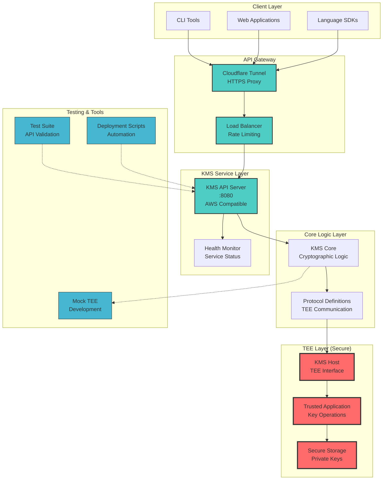

# STM32MP157F-DK2
My poor dev experience on ARM chips with TEE for AirAccount TMS

## Background
We select this as our dev env for our AirAccount TMS:

More info at here: [KMS](https://github.com/AAStarCommunity/AirAccount/tree/KMS)

## Resources

AI
https://www.bilibili.com/video/BV111y8BuELC/?spm_id_from=333.1387.homepage.video_card.click&vd_source=0a978d5cb963890b0cab49f66fae30af

官方B站：
https://space.bilibili.com/2100019006?from=search&seid=6727742697039098458&spm_id_from=333.337.0.0
st中国
https://www.stmcu.com.cn/Designresource/list/STM32%20MCU/firmware_software/software
官方论坛：
https://shequ.stmicroelectronics.cn/thread-636531-1-1.html

wiki：
https://wiki.st.com/stm32mpu/wiki/STM32MP157x-DKx_-_hardware_description
https://wiki.st.com/stm32mpu/wiki/Getting_started/STM32MP1_boards/STM32MP157x-DK2%20

官方文档：
https://www.st.com/resource/en/user_manual/um2909-getting-started-with-xlinuxgnss1-package-for-developing-gnss-applications-on-linux-os-stmicroelectronics.pdf

工具:
https://www.st.com/en/evaluation-tools/stm32mp157f-dk2.html#documentation

