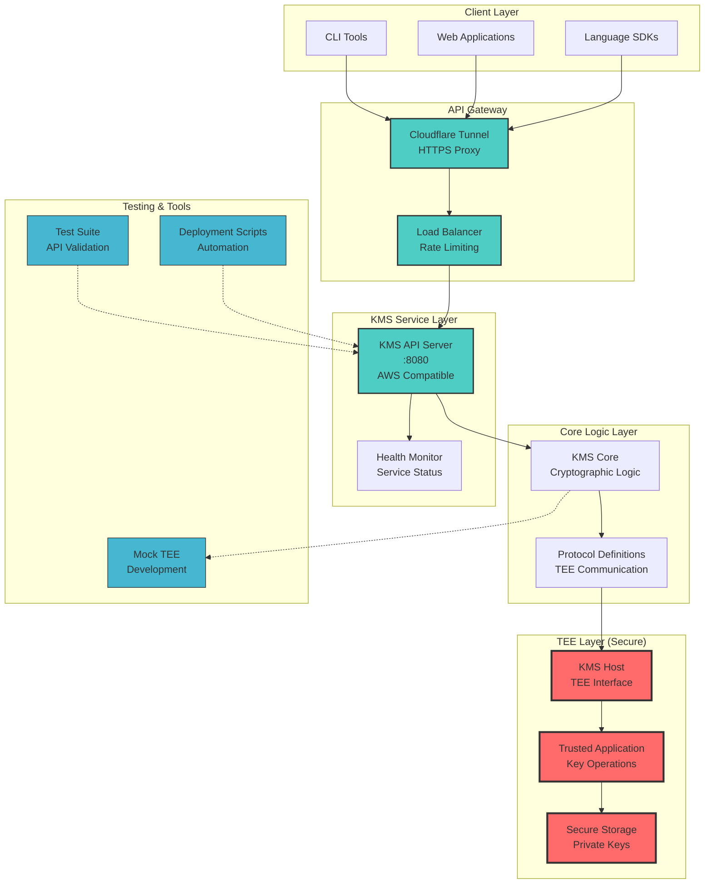

# STM32MP157F-DK2 开发项目

基于 STM32MP157F-DK2 开发板的 AirAccount TMS (Trusted Management Service) 硬件 TEE 实现。

**使命**: Accounts for All

## 项目概述

本项目旨在将 AirAccount KMS 从不稳定的 Docker/QEMU OP-TEE 环境迁移到真实的硬件平台,最终实现去中心化的密钥管理系统。

<a href="https://wiki.st.com/stm32mpu/wiki/Getting_started/STM32MP1_boards/STM32MP157x-DK2" >  </a>

**关键特性**:
- 基于 ARM TrustZone 的 OP-TEE 安全环境
- 真实硬件的密钥安全存储
- 断电后数据持久化
- 去中心化节点部署

<br clear="left"/>

相关项目: [AirAccount KMS](https://github.com/AAStarCommunity/AirAccount/tree/KMS) | [Istanbul Hackathon](https://ethglobal.com/showcase/airaccount-swqix)

## 快速开始

### 前置要求

- STM32MP157F-DK2 开发板
- Ubuntu 20.04+ / Debian 11+
- 8GB+ 内存
- 50GB+ 磁盘空间

### 一分钟上手

#### Mac 用户 (推荐 - 板上直接编译)

```bash
# 1. 下载官方镜像并烧录到 SD 卡
# 参考: docs/mac-development-workflow.md

# 2. 连接硬件并启动
# USB-C 供电 + Mini USB (调试) + 以太网

# 3. SSH/VNC 连接开发板
ssh root@<board-ip>

# 4. 在开发板上 clone 代码并编译
git clone https://github.com/AAStarCommunity/AirAccount.git
cd AirAccount && make
```

**详细指南**: [Mac 开发工作流完整指南](docs/mac-development-workflow.md)
**连接问题?** [Mac 连接故障排查](docs/troubleshooting-mac-connection.md)

#### Ubuntu/Debian 用户 (交叉编译)

```bash
# 1. 克隆项目
git clone https://github.com/jhfnetboy/STM32MP157F-DK2.git
cd STM32MP157F-DK2

# 2. 安装开发环境
chmod +x scripts/setup-ubuntu-dev-env.sh
./scripts/setup-ubuntu-dev-env.sh

# 3. 连接硬件并开始开发
# 参考: docs/phase1-hardware-setup.md
```

## 文档导航

### 📚 完整文档

查看 [**docs/**](docs/) 目录获取所有文档。

### 🚀 Phase 1: 硬件迁移和 OP-TEE 验证

**目标**: 将 KMS 从 Docker/QEMU 迁移到 STM32MP157F-DK2 真实硬件

| 文档 | 描述 |
|------|------|
| [**Mac 开发工作流**](docs/mac-development-workflow.md) | ⭐ **Mac 用户必读** - VNC/SSH 连接,板上编译完整指南 |
| [**Mac 连接故障排查**](docs/troubleshooting-mac-connection.md) | 🔧 ST-LINK 未识别? WiFi 配置? 网络问题解决方案 |
| [**硬件连接指南**](docs/phase1-hardware-setup.md) | 手把手硬件连接,从开箱到首次启动 |
| [**开发环境配置**](docs/phase1-development-environment.md) | Ubuntu 交叉编译工具链完整安装 |
| [**OP-TEE 开发指南**](docs/phase1-optee-setup.md) | OP-TEE 编译、部署和 TA 开发 |

**核心交付物**:
- ✅ 稳定运行的硬件平台
- ✅ 完整的开发环境
- ✅ 功能完整的 KMS TA
- ✅ 性能和稳定性验证

### 🏭 Phase 2: 工业化和单节点部署

**目标**: 从开发板过渡到工业级硬件,实现生产环境部署

| 文档 | 描述 |
|------|------|
| [**工业硬件选型对比**](docs/phase2-industrial-hardware.md) | 详细的工业级硬件对比 (<$500/节点) |
| 单节点部署指南 | 生产环境单节点完整部署流程 *(待完成)* |

**核心交付物**:
- 工业级硬件选型和采购
- 单节点生产环境
- 完整的监控和备份
- 社区可 follow 的部署指南

### 🌐 Phase 3: 清迈社区去中心化实验

**目标**: 在清迈部署 3-5 节点的去中心化 KMS,验证技术和经济模型

| 文档 | 描述 |
|------|------|
| [**去中心化架构设计**](docs/phase3-architecture.md) | 多节点 KMS 架构,密钥分片,数据同步 |
| 社区治理模型 | 节点激励,社区投票,代币经济 *(待完成)* |
| 清迈实验计划 | 具体实施步骤和评估指标 *(待完成)* |

**核心交付物**:
- 3-5 节点在清迈部署
- 去中心化架构验证
- 社区治理和激励机制
- 真实用户采用和反馈

### 🗺️ 项目路线图

查看 [**ROADMAP.md**](ROADMAP.md) 了解完整的三阶段计划,时间表和资源需求。

### 🔧 自动化工具

| 脚本 | 用途 |
|------|------|
| [setup-ubuntu-dev-env.sh](scripts/setup-ubuntu-dev-env.sh) | Ubuntu 开发环境一键安装 |
| build-optee.sh | OP-TEE 自动编译 *(待完成)* |
| flash-sd-card.sh | SD 卡烧录辅助 *(待完成)* |
| verify-tee.sh | TEE 环境自动验证 *(待完成)* |




## 为什么要硬件迁移?

### 问题: OP-TEE on QEMU on Docker 不稳定

在 CMU ICDI 的 Mac mini M4 上运行 Docker/QEMU 模拟环境时遇到严重问题:

**关键痛点**:
- 断电后数据丢失 (私钥、Key ID 等敏感数据)
- 模拟环境不可靠
- 无法 24/7 稳定运行

<details>
<summary>查看问题截图</summary>


</details>

### 解决方案: 真实硬件 TEE

迁移到 STM32MP157F-DK2 真实硬件平台:
- ✅ 持久化存储 (eMMC/RPMB)
- ✅ 断电后数据不丢失
- ✅ 工业级稳定性
- ✅ 支持去中心化部署

## 参与贡献

我们欢迎社区贡献! 请查看 [贡献指南](CONTRIBUTING.md) (待创建)

**贡献方向**:
- 📝 改进文档和翻译
- 🐛 报告和修复 Bug
- ✨ 提出新功能建议
- 🧪 编写测试用例
- 🌐 参与社区节点运营 (Phase 3)

## 资金支持

AirAccount 是一个公共产品 (Public Goods),我们正在寻求资助:

- [Gitcoin Grants](https://gitcoin.co/)
- [Ethereum Foundation Grants](https://esp.ethereum.foundation/)
- [Web3 Foundation Grants](https://web3.foundation/grants/)

如果您愿意支持,请联系我们: [airaccount.aastar.io](https://airaccount.aastar.io)

## 社区和联系

- 🌐 **官网**: [airaccount.aastar.io](https://airaccount.aastar.io)
- 💬 **Discord**: (待创建)
- 🐦 **Twitter**: (待创建)
- 📧 **Email**: (待提供)

## License

MIT License - 查看 [LICENSE](LICENSE) 文件

## 致谢

感谢以下项目和组织:

- [OP-TEE](https://www.op-tee.org/) - 开源 TEE 实现
- [STMicroelectronics](https://www.st.com/) - STM32MP1 平台支持
- [ETHGlobal](https://ethglobal.com/) - Istanbul Hackathon 支持
- CMU ICDI - 研究场地支持
- 清迈开发者社区

## 参考资源

### STM32MP1 官方资源

- [STM32MP157F-DK2 产品页](https://www.st.com/en/evaluation-tools/stm32mp157f-dk2.html)
- [STM32MPU Wiki](https://wiki.st.com/stm32mpu)
  - [硬件描述](https://wiki.st.com/stm32mpu/wiki/STM32MP157x-DKx_-_hardware_description)
  - [入门指南](https://wiki.st.com/stm32mpu/wiki/Getting_started/STM32MP1_boards/STM32MP157x-DK2)
- [ST 官方论坛](https://community.st.com/s/)
- [ST 中国社区](https://shequ.stmicroelectronics.cn/)

### OP-TEE 资源

- [OP-TEE 官方文档](https://optee.readthedocs.io/)
- [OP-TEE GitHub](https://github.com/OP-TEE)
- [GlobalPlatform TEE 规范](https://globalplatform.org/)

### 社区教程和视频

- [STM32MP1 AI 应用视频教程](https://www.bilibili.com/video/BV111y8BuELC/)
- [ST 官方 B站频道](https://space.bilibili.com/2100019006)

### 开发工具下载

- [STM32CubeProgrammer](https://www.st.com/en/development-tools/stm32cubeprog.html) - 烧录工具
- [ST 中国资源中心](https://www.stmcu.com.cn/Designresource/list/STM32%20MCU/firmware_software/software)

### 技术论坛

- [ST 国际社区](https://community.st.com/s/)
- [ST 中国论坛](https://shequ.stmicroelectronics.cn/thread-636531-1-1.html)
- [OP-TEE Discussions](https://github.com/OP-TEE/optee_os/discussions)

---

**Built with ❤️ for "Accounts for All"**

